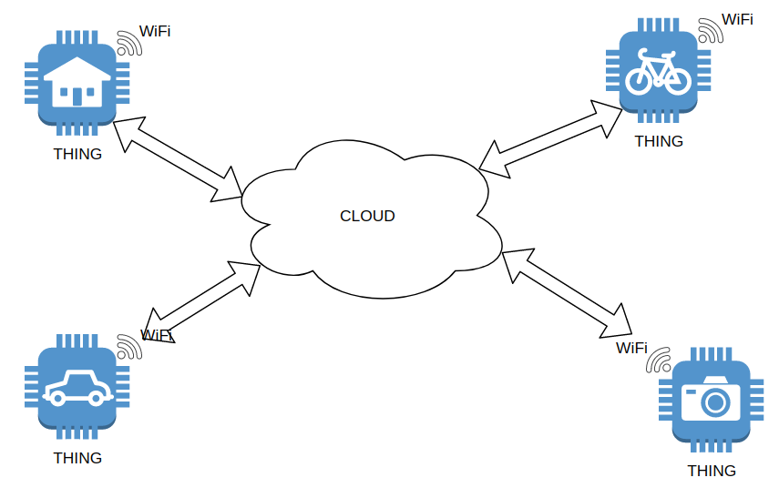
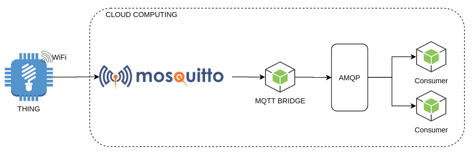

# Node IoT Architecture using MQTT and RabbitMQ

## Concepts

In short, Internet of Things is interconnectivity between objects. To make this concept possible, have many technology behinds. On picture 1, exemplification an IoT system.

  

Picture 1

With a quick look at this figure we can identify several layers:

- IoT Hardware

- IoT Firmware

- Network

- Local Infrastructure to access Internet

- Cloud computing

This project implements care to implements a simple cloud computer exemplification to works with IoT. Before presenting the adopted approach we need to understand what is MQTT? MQ Telemetry Transport - MQTT, is a lightweight messaging protocol for sensors and small mobile devices optimized for TCP / IP networks, if you want to improve on the subject read [more](https://developer.ibm.com/articles/iot-mqtt-why-good-for-iot/)

## Project Architecture

  

Picture 2

